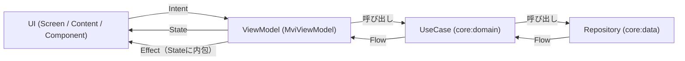

## 概要
ここでは、主にkei-1111.github.ioのアーキテクチャについて説明します。

## アーキテクチャ
kei-1111.github.io は、Clean Architecture（`feature` → `core:domain` → `core:data`）と MVI パターンを組み合わせたマルチモジュール構成です。`feature` モジュールは `core:data` への Gradle 依存を持たず、必ず `core:domain` の UseCase 経由でデータへアクセスします。

表示コンテンツの大半（プロフィール本文・ピン留めリポジトリ・使用言語・SNSリンクなど）は `core:data` の `ProfileRepository` に静的データとして定義しています。一方、GitHub の Contribution グラフだけは `ContributionsRepository` が `github-contributions-api.jogruber.de` から実際に取得する動的データで、取得できない場合（オフライン・タイムアウト・Android Preview ターゲット上での実行）は静的スナップショット（`FallbackContributions`）へフォールバックします。

## データフロー

- **Intent** … ユーザ操作（タブクリック、URLクリックなど）を ViewModel へ渡す入力（`core:mvi` の `Intent` を実装）
- **ViewModelState** … ViewModel の内部状態。`Result<T>`（Loading/Success/Error）など UI に見せる必要のない実装詳細も含む
- **State** … UI に公開される描画用の状態。`ViewModelState.toState()` で変換する。Effect もここに含める
- **Effect** … ナビゲーションや URL オープンなど、UI が一度だけ実行する副作用。State のプロパティとして持ち、`MviEffect` Composable が処理後に自動で消費（`ConsumeEffect` Intent 送出）する

## 具体例：プロフィール画面のデータ取得

1. `ProfileViewModel` の `init` で `GetProfileUseCase` を購読し、`GitHubProfile`（静的データ）を `ViewModelState.profile` に反映する
2. プロフィールを受け取った直後に一度だけ `GetContributionsUseCase(profile.handle)` を起動し、結果を `.asResult()` で `Flow<Result<ContributionCalendar>>` に変換して `ViewModelState.contributionsResult` に格納する
3. `ContributionsRepositoryImpl` は `@DefaultDispatcher`（Metro が注入する `Dispatchers.Default`）上で Contributions API を叩き、失敗時は `FallbackContributions.calendar`（静的スナップショット）を返す。Android ターゲットでは `fetchText()` の actual 実装が常に `null` を返すため（Preview 専用ビルドのため通信しない）、常にフォールバックが使われる
4. `toState()` は `contributionsResult` が `Result.Success` のときだけ `State.contributions` に値を入れる。Loading/Error のときは `null` のままとし、Preview パネルは値が届くまで何も描画しない

## DI（Metro）

- `composeApp` の `AppGraph`（`@DependencyGraph(scope = AppScope::class)`、`ViewModelGraph` を継承）が DI ルート
- Repository/UseCase の実装は `internal class` に `@ContributesBinding(AppScope::class)` + `@SingleIn(AppScope::class)` + `@Inject` を付与するだけで、Metro がインターフェース型として自動的に `AppGraph` へバインドする（明示的な Multi-binding モジュール定義は不要）
- Dispatcher のような値は `@BindingContainer` + `@ContributesTo(AppScope::class)` を付与した `DispatcherBindings`（`core:common`）が `@Provides` 経由で供給する
- ViewModel は `@Inject @ViewModelKey @ContributesIntoMap(AppScope::class, binding<ViewModel>())` を付与し、Navigation Entry 内で `metroViewModel()` により取得する。`composeApp` の `InjectedViewModelFactory`（`MetroViewModelFactory` 実装）が実際の生成を担う

## ナビゲーション（Navigation 3）

- `composeApp` の `AppNavDisplay` が単一の `NavDisplay` とバックスタック（`rememberNavBackStack`）を保持する唯一の場所
- 各 feature は `navigation/XxxNavigationRoute.kt` に `NavKey`（例: `Splash`, `Profile`）を、`navigation/XxxNavigation.kt` に `EntryProviderScope<NavKey>.xxxEntries()` 拡張関数を定義する。`AppNavDisplay` はこれらを `entryProvider { splashEntries(...); profileEntries() }` の形でまとめて登録する
- wasmJs はリフレクション非対応のため、バックスタックの直列化・復元用に全 `NavKey` サブクラスを登録した `SerializersModule`（`navKeySavedStateConfiguration`）を明示的に用意している
- Splash → Profile の遷移は `SplashEffect.NavigateProfile` を `MviEffect` で受け、`navigateProfile()`（`splashEntries` に渡されたコールバック）経由で `backStack.add(Profile)` する
