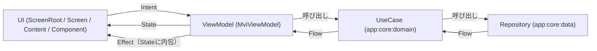

## 概要
ここでは、主にkei-1111.github.ioのアーキテクチャについて説明します。

## アーキテクチャ
クライアント（`:app`）は Clean Architecture（`app:feature` → `app:core:domain` → `app:core:data`）と MVI パターンを組み合わせたマルチモジュール構成です。`app:feature` モジュールは `app:core:data` への Gradle 依存を持たず、必ず `app:core:domain` の UseCase 経由でデータへアクセスします。データの実体は自作バックエンド API サーバー（`:server`、Ktor / Cloud Run）が配信し、`:app` と `:server` は共有 DTO モジュール `:shared:model` を介して JSON 契約を共有します。

`ProfileRepository`（プロフィール本文・統計・ピン留めリポジトリ・使用言語・SNSリンク）も `ContributionsRepository`（Contribution グラフ）も、`app:core:data` から自作 API（`GET /api/profile` / `GET /api/contributions`）を叩いて取得します。取得できない場合（オフライン・タイムアウト・サーバーダウン・Android Preview ターゲット上での実行）は静的スナップショット（`FallbackProfile` / `FallbackContributions`）へフォールバックします。サーバー側はさらに GitHub 公式 GraphQL API から統計とコントリビューションをライブ取得し、静的な自己紹介コンテンツと合成します。

## データフロー

- **Intent** … ユーザ操作（タブクリック、URLクリックなど）を ViewModel へ渡す入力（`app:core:mvi` の `Intent` を実装）
- **ViewModelState** … ViewModel の内部状態。`Result<T>`（Loading/Success/Error）など UI に見せる必要のない実装詳細も含む
- **State** … UI に公開される描画用の状態。`ViewModelState.toState()` で変換する。Effect もここに含める
- **Effect** … ナビゲーションや URL オープンなど、UI が一度だけ実行する副作用。State のプロパティとして持ち、`MviEffect` Composable が処理後に自動で消費（`ConsumeEffect` Intent 送出）する

## 具体例：プロフィール画面のデータ取得

1. `ProfileViewModel` の `init` で `GetProfileUseCase()` を `.asResult()` で `Flow<Result<GitHubProfile>>` に変換して購読し、`ViewModelState.profileResult` に格納する（`toState()` が `Result.Success` を `State.profile` に展開する）
2. `GetContributionsUseCase()` と `GetLicensesUseCase()` も同じ `init` から並行して購読し、それぞれ `contributionsResult` / `licensesResult` に格納する（取得ユーザーはサーバー側で固定のため引数はない）
3. `ContributionsRepositoryImpl` は `@DefaultDispatcher`（Metro が注入する `Dispatchers.Default`）上で自作 API（`GET /api/contributions`）を叩き、失敗時は `FallbackContributions.calendar`（静的スナップショット）を返す。Android ターゲットでは `fetchText()` の actual 実装が常に `null` を返すため（Preview 専用ビルドのため通信しない）、常にフォールバックが使われる
4. `toState()` は `contributionsResult` が `Result.Success` のときだけ `State.contributions` に値を入れる。Loading/Error のときは `null` のままとし、Preview パネルは値が届くまで何も描画しない

## DI（Metro）

- `app:webApp` の `AppGraph`（`@DependencyGraph(scope = AppScope::class)`、`ViewModelGraph` を継承）が DI ルート
- Repository/UseCase の実装は `internal class` に `@ContributesBinding(AppScope::class)` + `@SingleIn(AppScope::class)` + `@Inject` を付与するだけで、Metro がインターフェース型として自動的に `AppGraph` へバインドする（明示的な Multi-binding モジュール定義は不要）
- Dispatcher のような値は `@BindingContainer` + `@ContributesTo(AppScope::class)` を付与した `DispatcherBindings`（`app:core:common`）が `@Provides` 経由で供給する
- ViewModel は `@Inject @ViewModelKey @ContributesIntoMap(AppScope::class, binding<ViewModel>())` を付与し、Navigation Entry 内で `metroViewModel()` により取得する。`app:webApp` の `InjectedViewModelFactory`（`MetroViewModelFactory` 実装）が実際の生成を担う

## ナビゲーション（Navigation 3）

- `app:webApp` の `AppNavDisplay` が単一の `NavDisplay` とバックスタック（`rememberNavBackStack`）を保持する唯一の場所
- 各 feature は `navigation/XxxNavigationRoute.kt` に `NavKey` と返却する結果型、`navigation/XxxNavigationExtensions.kt` に遷移拡張、`navigation/XxxNavigation.kt` に `EntryProviderScope<NavKey>.xxxEntries()` 拡張関数を定義する。`AppNavDisplay` はこれらを `entryProvider { splashEntries(...); profileEntries(...) }` の形でまとめて登録する
- wasmJs はリフレクション非対応のため、バックスタックの直列化・復元用に全 `NavKey` サブクラスを登録した `SerializersModule`（`navKeySavedStateConfiguration`）を明示的に用意している
- Splash → Profile の遷移は `SplashEffect.NavigateProfile` を `MviEffect` で受け、`splashEntries` に渡されたコールバック `backStack::navigateProfile`（`ProfileNavigationExtensions.kt` の拡張）経由で `Profile` を push する
- ダイアログデスティネーションは `entry<X>(metadata = dialogTransition())` で表示方法を宣言し、`DialogSceneStrategy` が前の entry 上に描画する（scrim も同 strategy が持つ）
- デスティネーション間の one-shot 結果は `app:core:navigation` の `ResultEventBus` を使い、結果型の `typeOf<T>()` で識別する。`AppNavDisplay` が Composition Local で提供し、送信側 Root が結果送信後に戻り、受信側 `entry<>` 内の `ResultEffect<T>` が既存 Intent へ再ディスパッチする
