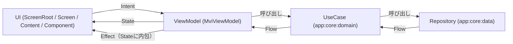

<!-- 編集時は本ファイルと英語版 ArchitectureOverview.en.md を必ず同期させること。 -->

<a href="ArchitectureOverview.en.md">🌐 English</a>

## アーキテクチャ

- クライアント（`:app`）は Clean Architecture（`app:feature` → `app:core:domain` → `app:core:data` → `app:core:api`（HTTP）/ `app:core:local`（永続化））と MVI を組み合わせたマルチモジュール構成
- `app:feature` は `app:core:data` への Gradle 依存を持たず、必ず `app:core:domain` の UseCase 経由でデータへアクセス
- データは自作 API サーバー（`:server`、Ktor / Cloud Run）が配信し、`:app` と `:server` は `:shared:model` で JSON 契約を共有。サーバーは GitHub GraphQL API のライブデータと、管理コンソール(kei-1111-admin)が GCS へ公開したコンテンツを合成
- 取得失敗（オフライン・タイムアウト・サーバーダウン・Android Preview 実行）は Flow が例外を投げ、ViewModel の `.asResult()` が `Result.Error` に変換し、UI がエラー表示＋再試行を描画

## データフロー

```mermaid
flowchart LR
    UI["UI (ScreenRoot / Screen / Content / Component)"]
    VM["ViewModel (MviViewModel)"]
    UC["UseCase (app:core:domain)"]
    Repo["Repository (app:core:data)"]

    UI -->|Intent| VM
    VM -->|State| UI
    VM -->|Effect（Stateに内包）| UI
    VM -->|呼び出し| UC
    UC -->|呼び出し| Repo
    Repo -->|Flow| UC
    UC -->|Flow| VM
```

- **Intent** … ユーザー操作を ViewModel へ渡す入力
- **ViewModelState** … ViewModel の内部状態。`Result<T>` など UI に見せない実装詳細を含む
- **State** … UI に公開される描画用状態。`ViewModelState.toState()` で変換し、Effect は基底クラスが付与して内包する
- **Effect** … UI が一度だけ実行する副作用。`MviEffect` が処理後に `onConsume` を呼び、ScreenRoot が `ConsumeEffect` Intent で消費する

MVI 実装規約の正本は `.claude/rules/mvi-architecture.md`。

## DI（Metro）

- `app:webApp` の `AppGraph`（`@DependencyGraph(scope = AppScope::class)`）が DI ルート
- Repository/UseCase の実装は `internal class` に `@ContributesBinding(AppScope::class)` + `@SingleIn(AppScope::class)` + `@Inject` を付与するだけで自動バインド
- Dispatcher のような値は `@BindingContainer` + `@ContributesTo(AppScope::class)` の `DispatcherBindings`（`app:core:common`）が供給
- ViewModel は `@ViewModelKey` + `@ContributesIntoMap` で登録し、Navigation Entry 内の `metroViewModel()` で取得

バインディング規約（テスト用シームの例外を含む）の正本は `.claude/rules/data-layer.md`、ViewModel パターンは `.claude/rules/mvi-architecture.md`。

## ナビゲーション（Navigation 3）

- 単一の `NavDisplay` とバックスタックを保持するのは `app:webApp` の `AppNavDisplay` のみ
- 各 feature は `NavKey` と `xxxEntries()` 拡張関数を定義し、`AppNavDisplay` がまとめて登録（ファイルレイアウトの正本は `.claude/rules/navigation.md`）
- wasmJs はリフレクション非対応のため、各 feature が `@IntoSet` で寄与する `SerializersModule` 断片を `AppGraph.navKeySerializers` に集約し、バックスタックの直列化・復元に使う
- ダイアログは `entry<X>(metadata = dialogTransition())` で宣言し、`:app:core:navigation` の `InlineDialogSceneStrategy` が前の entry 上に描画（dismiss 挙動と a11y は strategy が所有）
- デスティネーション間の one-shot 結果は `ResultEventBus` を使い、受信側 `entry<>` 内の `ResultEffect<T>` が既存 Intent へ再ディスパッチ
