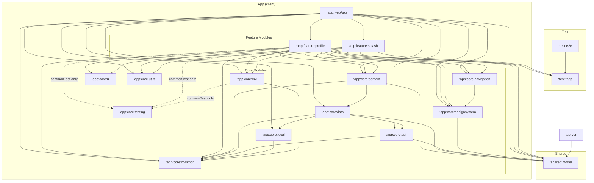

<!-- Keep this file and the Japanese version ModuleOverview.md in sync when editing. -->

<a href="ModuleOverview.md">🌐 日本語</a>

## Overview
kei-1111.github.io is a multi-module project split by responsibility into a client (`:app`), a server (`:server`), a shared contract (`:shared:model`), and tests (`:test`).

## Module dependency diagram

- The top level has three layers: `:app` / `:server` / `:shared:model`. `:shared:model` is a leaf (no dependencies), and `:app` and `:server` do not depend on each other
- Arrows show dependency direction (dependent → dependency)
- `:app:feature:*` does not depend on `:app:core:data` (data access always goes through `:app:core:domain`)
- `:test:tags` is included in the production distribution as a feature commonMain dependency; `:test:e2e` sits outside the production graph

## Modules

`:app` and `:test` are directory groups, not real modules.

| Module | Role | Canonical source & conventions |
|---|---|---|
| `:shared:model` | DTOs shared by client and server. `@Serializable` types form the JSON contract between them | `.claude/rules/shared-model.md`; wire shape is covered by the server's contract tests |
| `:server` | Ktor/JVM backend deployed to Cloud Run. Assembles data from the GitHub GraphQL API and static content, and owns caching, rate limiting, and failure responses | `.claude/rules/server.md`; routes are canonical in source |
| `:app:webApp` | Entry point. Implements the DI root `AppGraph` and `AppNavDisplay` (Navigation 3). The only distribution target is wasmJs | Canonical in source |
| `:app:core:common` | Non-UI foundation shared across layers: result types, Flow conversions, dispatchers | `.claude/rules/error-handling.md` |
| `:app:core:mvi` | MVI foundation, including ViewModel and the State/Intent/Effect contract | `.claude/rules/mvi-architecture.md`; tests in `.claude/rules/mvi-testing.md` |
| `:app:core:navigation` | Navigation 3 shared scene strategies, transition metadata, and one-shot result notification infrastructure | `.claude/rules/navigation.md` |
| `:app:core:testing` | Coroutine/ViewModel test support for client unit tests only; excluded from the distribution | `.claude/rules/mvi-testing.md` |
| `:app:core:ui` | Stateful Compose helpers with no visual styling (visual elements belong to `:designsystem`) | Canonical in source |
| `:app:core:domain` | Business logic (UseCase). Thin wrappers around Repository calls that return `Flow` | `.claude/rules/usecase.md` |
| `:app:core:data` | Data access layer via Repositories. Aggregates remote, local, and static content into `Flow` | `.claude/rules/data-layer.md`; Repository list is canonical in source |
| `:app:core:api` | HTTP communication layer with the self-built backend. Fetches, deserializes, and folds failures into `null` | `.claude/rules/data-layer.md`; structure is canonical in source |
| `:app:core:local` | Local persistence layer. DataStore access for theme settings, with recovery on corruption | `.claude/rules/data-layer.md` |
| `:app:core:designsystem` | Material-independent theme, color, typography, and icon foundation plus shared UI components | `.claude/rules/ui-implementation.md` |
| `:app:core:utils` | expect/actual utilities that absorb differences between the browser and the non-shipping Android target | Canonical in source |
| `:app:feature:profile` | The main feature: an Android Studio-style IDE UI displaying profile, projects, tech stack, and licenses | `.claude/rules/ui-implementation.md`; UI behavior is canonical in source |
| `:app:feature:splash` | Startup build-log-style UI, resource preparation, and transition to the main screen on success | Canonical in source |
| `:test:tags` | `TestTags` constants shared between Compose and Playwright | Build configuration |
| `:test:e2e` | Verifies the statically served wasm client in a real Playwright/JVM browser | `.claude/rules/ui-testing.md`; CI conditions are canonical in the workflow |
