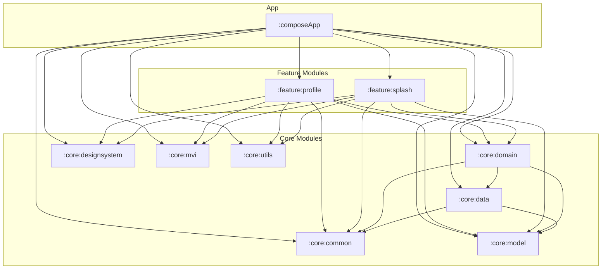

## 概要
kei-1111.github.io は、モダンAndroidアプリのようにマルチモジュール構成としています。
ここでは、分割したそれぞれのModuleについて説明します。

## モジュール依存関係図

矢印は依存の方向（依存元 → 依存先）を表します。`:feature:*` は `:core:data` に依存していません（データアクセスは必ず `:core:domain` 経由）。

## Modules

- `:composeApp`
  アプリのエントリーポイント。DIルートの `AppGraph`（Metro `@DependencyGraph`）と、単一の `NavDisplay` + バックスタックを持つ `AppNavDisplay`（Navigation 3）を実装しています。wasmJs のみが配布ターゲットで、Android ターゲットは持ちません。

- `:core`
  - `:common`
    `Result<T>`（Success/Error/Loading）と `Flow<T>.asResult()`、`DefaultDispatcher`（Metro `@Qualifier`）と `Dispatchers.Default` を供給する `DispatcherBindings`（`@BindingContainer`）を定義しています。
  - `:mvi`
    MVI基盤クラスの定義をしています。`MviViewModel<VS, S, I>`（内部状態 `ViewModelState` を公開用 `State` に変換する `StateFlow` ベースの基底ViewModel）、`Intent` / `State` / `ViewModelState<S>` のマーカーインターフェース、一度きりの Effect を安全に消費する `MviEffect` Composable を持ちます。
  - `:domain`
    ビジネスロジックを UseCase として実装しています。`GetProfileUseCase` / `GetContributionsUseCase` はそれぞれ対応する Repository を呼び出すだけの薄いラッパーで、`distinctUntilChanged()` を適用した `Flow` を返します。実装は `internal class` + `@ContributesBinding(AppScope::class)` で、Metro がインターフェース型として自動的にバインドします。
  - `:data`
    Repositoryパターンによるデータアクセス層です。`ProfileRepository` は `DefaultGitHubProfile`（`ProfileContent.kt` に定義した静的データ）を `Flow` で公開します。`ContributionsRepository` は GitHub Contributions API（`github-contributions-api.jogruber.de`）から実データを取得し、失敗時は静的スナップショットの `FallbackContributions` にフォールバックします。実際の通信 (`fetchText()`) はプラットフォーム別の expect/actual で、wasmJs は `XMLHttpRequest`、Android は常に `null`（Preview 専用ターゲットのため通信しない）を返します。
  - `:model`
    アプリ全体で使用するデータクラスの定義をしています。`GitHubProfile` / `PinnedRepo` / `LanguageShare` / `LinkService`（プロフィールカード関連）と `ContributionCalendar` / `ContributionDay`（Contributionグラフ関連）です。
  - `:designsystem`
    テーマカラーの定義や使用するフォントの導入をしています。`KeiTheme`（Material 非依存の独自テーマ。`KeiTheme.colors` / `.typography` / `.shapes` で配布し、非 Composable からは既定インスタンス `keiColorScheme` を参照する）、Android Studio の Islands Dark を再現した配色スキーム `KeiColorScheme`、`KeiTypography` / `KeiShapes`、JetBrains Mono / Noto Sans JP / Zen Kaku Gothic New のフォントとプリロード処理（`FontPreload.kt`、wasmJs専用）を持ちます。レスポンシブ分岐用の `WindowLayout`（Desktop/Mobile）と `windowLayoutFor(width)` も置いています。画面固有の共通コンポーネントは現在未使用のため置いていません（追加する場合は `component/` に配置）。
  - `:utils`
    いろいろなモジュールで使用する、プラットフォーム差分を吸収する小さな関数（expect/actual）の定義をしています。渡したURLを開く `openUrl`（wasmJs: `window.open`、Android: no-op）、タブの表示/非表示を `State` として返す `rememberIsPageVisible`、OS/ブラウザの「視覚効果を減らす」設定を返す `prefersReducedMotion` を実装しています。

- `:feature`
  - `:profile`
    アプリの主機能である、Android Studio 風 IDE レイアウト（プロジェクトツリー / エディタ / プレビュー / ステータスバー）でプロフィール情報を掲載する画面の実装を行っています。`destination/profile/` に画面のMVI一式（Screen/ViewModel/ViewModelState/State/Intent/Effect）と `component/`（TitleBar・ProjectTree・EditorPane・PreviewPane・githubcard など）を持ちます。
  - `:splash`
    アプリ起動時に表示される、ビルドログ風のスプラッシュ画面の実装を行っています。フォント（JetBrains Mono / Noto Sans JP / Zen Kaku Gothic New）のロード完了を監視し、最低表示時間の経過後に成功シーケンスへ進み `SplashEffect.NavigateProfile` で Profile 画面へ遷移します。フォントロードが一定時間で完了しない場合はビルド失敗風の表示のままスプラッシュに留まります。
