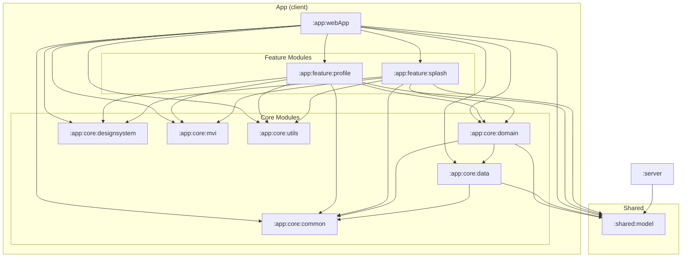

## 概要
kei-1111.github.io は、モダンAndroidアプリのようにマルチモジュール構成としています。
ここでは、分割したそれぞれのModuleについて説明します。

## モジュール依存関係図

トップレベルは `:app`（クライアント一式のグループ）/ `:server`（Ktor）/ `:shared:model`（両者が共有する DTO・契約）の3層です。`:shared:model` が葉（無依存）で、`:app` と `:server` は相互依存なしにそれぞれ `:shared:model` を指す DAG になります。

矢印は依存の方向（依存元 → 依存先）を表します。`:app:feature:*` は `:app:core:data` に依存していません（データアクセスは必ず `:app:core:domain` 経由）。

## Modules

- `:shared:model`
  client（`:app`）と server（`:server`）が共有するデータクラスの定義をしています。`GitHubProfile` / `PinnedRepo` / `LanguageShare` / `LinkService`（プロフィールカード関連）と `ContributionCalendar` / `ContributionDay`（Contributionグラフ関連）は `@Serializable`（JSON 契約）です。`License.kt`（`LicenseType` / `LicenseEntry` / `ThirdPartyLicenses`）は client 専用の静的コンテンツ型で、JSON 契約に含まれないため `@Serializable` を付けません。`ImmutableList` フィールドは自作の `ImmutableListSerializer` で扱います。直列化名は全フィールド・全 enum 定数とも `@SerialName` で固定し（互換性ルールは `GitHubProfile` の KDoc 参照）、wire 形状は `:server` の `SharedModelContractTest` が固定しています。wasmJs / Android（Preview 用）に加えて、`:server` から使うための jvm ターゲットを `kei_1111.kmp.shared` convention plugin で持ちます。

- `:server`
  自作バックエンド API サーバー（Ktor / JVM、CIO エンジン）。`GET /api/profile`（静的な自己紹介 + GitHub GraphQL API からライブ取得した統計 followers/following/repos/totalStars の合成）と `GET /api/contributions`（Contribution カレンダー）を配信します。GitHub へのアクセスは PAT（`GITHUB_TOKEN` 環境変数、Cloud Run では Secret Manager 経由）で認証し、取得結果は TTL キャッシュ（single-flight / stale-if-error）で保持します。GitHub API 失敗時、profile は静的値のまま 200、contributions は 503 を返します。Cloud Run（scale-to-zero）にデプロイします。

- `:app`
  クライアント一式のグループ（実モジュールではなくディレクトリ）。配下に `:app:webApp` / `:app:core:*` / `:app:feature:*` を持ちます。

- `:app:webApp`
  アプリのエントリーポイント。DIルートの `AppGraph`（Metro `@DependencyGraph`）と、単一の `NavDisplay` + バックスタックを持つ `AppNavDisplay`（Navigation 3）を実装しています。wasmJs のみが配布ターゲットで、Android ターゲットは持ちません。

- `:app:core`
  - `:common`
    `Result<T>`（Success/Error/Loading）と `Flow<T>.asResult()`、`DefaultDispatcher`（Metro `@Qualifier`）と `Dispatchers.Default` を供給する `DispatcherBindings`（`@BindingContainer`）を定義しています。訪問者の操作を Logcat 風エントリとして保持するアプリスコープの `InteractionLog`（`logging/`。`LogLevel` / `LogEntry` と、発生時刻文字列を返す expect/actual）もここに置いています。
  - `:mvi`
    MVI基盤クラスの定義をしています。`MviViewModel<VS, S, I>`（内部状態 `ViewModelState` を公開用 `State` に変換する `StateFlow` ベースの基底ViewModel）、`Intent` / `State` / `ViewModelState<S>` のマーカーインターフェース、一度きりの Effect を安全に消費する `MviEffect` Composable を持ちます。
  - `:domain`
    ビジネスロジックを UseCase として実装しています。`GetProfileUseCase` / `GetContributionsUseCase` / `GetLicensesUseCase` はそれぞれ対応する Repository を呼び出すだけの薄いラッパーで、`distinctUntilChanged()` を適用した `Flow` を返します。実装は `internal class` + `@ContributesBinding(AppScope::class)` で、Metro がインターフェース型として自動的にバインドします。
  - `:data`
    Repositoryパターンによるデータアクセス層です。`ProfileRepository` / `ContributionsRepository` はどちらも自作バックエンド API（`:server`）を `fetchText()` で叩き（`API_BASE_URL` は `network/ApiConfig.kt`）、失敗時は静的スナップショット（`FallbackProfile` / `FallbackContributions`）にフォールバックします。実際の通信 (`fetchText()`) はプラットフォーム別の expect/actual（`network/` パッケージ）で、wasmJs は `XMLHttpRequest`、Android は常に `null`（Preview 専用ターゲットのため通信しない）を返します。クライアントは Ktor を使いません（Ktor は `:server` 専用）。`LicensesRepository` は通信せず、コンパイル時定数のサードパーティライセンス（`license/LicenseContent.kt`）を `flowOf` で返します。`ThemeRepository` はテーマ選択（ダーク/ライト）を DataStore Preferences に永続化します（`theme/ThemeDataStore.kt` の expect/actual で生成し、wasmJs は `WebLocalStorage` = ブラウザの `localStorage`、Android は実行されないコンパイル用スタブ。読み出しは `Flow<Boolean>`、保存は `suspend fun`）。
  - `:designsystem`
    テーマカラーの定義や使用するフォントの導入をしています。`KeiTheme(isDark)`（Material 非依存の独自テーマ。スキームを内部解決して `KeiTheme.colors` / `.typography` / `.shapes` / `.icons` で配布し、非 Composable ヘルパへは `KeiColorScheme` を引数で渡す）、Android Studio の Islands Dark と Islands Light の両方を再現した配色スキーム `KeiColorScheme`（実インスタンスは `KeiDarkColorScheme` / `KeiLightColorScheme`、`isDark` フィールドがテーマの正体を運ぶ。テーマ状態は `app:webApp` の `App` が所有し、切替は `onToggleTheme` コールバック配線）、`KeiTypography` / `KeiShapes`、テーマ依存アイコン `KeiIcons`（`ThemedIcon` = dark/light 焼き込みペア、`TintedIcon` = 呼出側 tint のモノクロ）、JetBrains Mono / Noto Sans JP / Zen Kaku Gothic New のフォントとプリロード処理（`FontPreload.kt`、wasmJs専用）を持ちます。レスポンシブ分岐用の `WindowLayout`（Desktop/Mobile）と `windowLayoutFor(width)` も置いています。画面固有の共通コンポーネントは現在未使用のため置いていません（追加する場合は `component/` に配置）。
  - `:utils`
    いろいろなモジュールで使用する、プラットフォーム差分を吸収する小さな関数（expect/actual）の定義をしています。渡したURLを開く `openUrl`（wasmJs: `window.open`、Android: no-op）、タブの表示/非表示を `State` として返す `rememberIsPageVisible`、OS/ブラウザの「視覚効果を減らす」設定を返す `prefersReducedMotion`、リサイズ境界用のマウスカーソル `VerticalResizeCursor` / `HorizontalResizeCursor`（wasmJs: `PointerIcon.fromKeyword`、Android: 既定カーソル）、閲覧環境のラベルを返す `visitorDeviceLabel`（wasmJs: User-Agent からブラウザとOSを判定）を実装しています。

- `:app:feature`
  - `:profile`
    アプリの主機能である、Android Studio 風 IDE レイアウト（プロジェクトツリー / エディタ / プレビュー / Logcat ツールウィンドウ / ステータスバー）でプロフィール情報とサードパーティライセンスを掲載する画面の実装を行っています。エディタページは `EditorPage`（Readme / Profile / Licenses）で切り替え、初期タブは README.md のみ（選択済み）で、ツリーから開いたページがタブに追加されます。`destination/profile/` のトップレベルには画面の契約・オーケストレーションファイル一式（ScreenRoot/Screen/ViewModel/ViewModelState/State/Intent/Effect）のみを置き、目的別サブパッケージとして `content/`（Desktop/Mobile Content）・`model/`（`EditorPage` など画面ローカルなUIモデル）・`component/`（TitleBar・ProjectTree・EditorPane・PreviewPane・LogcatPanel・githubcard・licensecard など）・`preview/`（Preview 用サンプルデータ）を持ちます。`splash` も同一のレイアウトです。
  - `:splash`
    アプリ起動時に表示される、ビルドログ風のスプラッシュ画面の実装を行っています。フォント（JetBrains Mono / Noto Sans JP / Zen Kaku Gothic New）のロード完了を監視し、最低表示時間の経過後に成功シーケンスへ進み `SplashEffect.NavigateProfile` で Profile 画面へ遷移します。フォントロードが一定時間で完了しない場合はビルド失敗風の表示のままスプラッシュに留まります。
