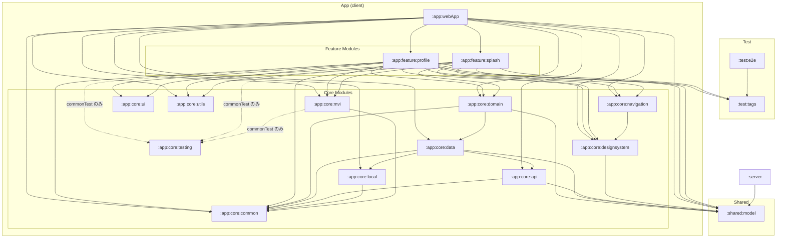

## 概要
kei-1111.github.io は、クライアント、サーバー、共有契約、テストを責務ごとに分けたマルチモジュール構成です。
ここでは各モジュールの役割と依存関係を説明します。

## モジュール依存関係図

トップレベルは `:app`（クライアント一式のグループ）/ `:server`（Ktor）/ `:shared:model`（両者が共有する DTO・契約）の3層です。`:shared:model` が葉（無依存）で、`:app` と `:server` は相互依存なしにそれぞれ `:shared:model` を指す DAG になります。加えて E2E テスト用の `:test:tags` / `:test:e2e` があります。`:test:e2e` は本番の依存グラフとは別枠ですが、`:test:tags` は feature モジュールの commonMain 依存として本番配布物にも含まれます（詳細は Modules 節）。

矢印は依存の方向（依存元 → 依存先）を表します。`:app:feature:*` は `:app:core:data` に依存していません（データアクセスは必ず `:app:core:domain` 経由）。

```mermaid
flowchart TB
    subgraph "Shared"
        model[":shared:model"]
    end

    subgraph "Test"
        testTags[":test:tags"]
        testE2e[":test:e2e"]
    end

    server[":server"]

    subgraph "App (client)"
        webApp[":app:webApp"]

        subgraph "Feature Modules"
            profile[":app:feature:profile"]
            splash[":app:feature:splash"]
        end

        subgraph "Core Modules"
            domain[":app:core:domain"]
            data[":app:core:data"]
            api[":app:core:api"]
            local[":app:core:local"]
            designsystem[":app:core:designsystem"]
            mvi[":app:core:mvi"]
            navigation[":app:core:navigation"]
            testing[":app:core:testing"]
            ui[":app:core:ui"]
            common[":app:core:common"]
            utils[":app:core:utils"]
        end
    end

    webApp --> profile & splash
    webApp --> api & common & data & designsystem & domain & local & mvi & navigation & utils & model

    profile & splash --> common & designsystem & domain & mvi & navigation & ui & utils & model & testTags
    profile & splash & mvi -. commonTest のみ .-> testing

    domain --> common & data & model
    data --> api & common & local & model
    api --> common & model
    local --> common
    mvi --> common
    navigation --> designsystem
    designsystem --> model

    server --> model

    testE2e --> testTags
```

## Modules

- `:shared:model`
  クライアント（`:app`）とサーバー（`:server`）が共有するデータクラスを定義します。`@Serializable` 型は独立デプロイされる両者の JSON 契約です。互換性ルールは `.claude/rules/shared-model.md`、正確な型・シリアライザ・ターゲット構成はこのモジュールのソースコードとビルド設定、通信時の形状はサーバーの契約テストを正本とします。クライアント専用の静的ライセンス型は JSON 契約に含みません。

- `:server`
  Cloud Run にデプロイする Ktor/JVM バックエンドです。プロフィール、Contribution、Issue、作品のデータを GitHub GraphQL API と静的コンテンツから組み立て、キャッシュ・レート制限・障害時応答を含む API ポリシーを担います。正確なルートと挙動はサーバーのソースコード、実装規約は `.claude/rules/server.md` を正本とします。

- `:app`
  クライアント一式のグループ（実モジュールではなくディレクトリ）。配下に `:app:webApp` / `:app:core:*` / `:app:feature:*` を持ちます。

- `:app:webApp`
  アプリのエントリーポイント。DIルートの `AppGraph`（Metro `@DependencyGraph`）と、単一の `NavDisplay` + バックスタックを持つ `AppNavDisplay`（Navigation 3）を実装し、`:app:core:navigation` の `InlineDialogSceneStrategy` を組み込みます。wasmJs のみが配布ターゲットで、Android ターゲットは持ちません。

- `:app:core`
  - `:common`
    結果型と Flow 変換、ディスパッチャ、例外抑制、操作ログなど、複数層で共有する非 UI 基盤を定義します。エラー境界の規約は `.claude/rules/error-handling.md` を正本とします。
  - `:mvi`
    ViewModel、State/Intent/Effect 契約と一度きりの Effect 消費を含む MVI 基盤を定義します。実装規約は `.claude/rules/mvi-architecture.md`、テスト規約は `.claude/rules/mvi-testing.md` を正本とします。
  - `:navigation`
    Navigation 3 の共通シーン戦略、遷移メタデータ、デスティネーション間の一度きりの結果通知基盤を定義します。正確な所有境界と利用方法は `.claude/rules/navigation.md` を正本とします。
  - `:testing`
    クライアントのユニットテスト専用の coroutine/ViewModel 支援コードを定義し、配布物には含めません。利用方法は `.claude/rules/mvi-testing.md` を正本とします。
  - `:ui`
    見た目を持たない状態付き Compose ヘルパーを定義します。視覚トークンと共有 Composable は `:designsystem` が担います。
  - `:domain`
    ビジネスロジックを UseCase として実装しています。各 UseCase は対応する Repository を呼び出す薄いラッパーで、重複を抑えた `Flow` を返します。実装形とテスト要件は `.claude/rules/usecase.md` と `.claude/rules/app-testing.md` を正本とします。
  - `:data`
    Repository パターンによるデータアクセス層です。リモート API、ローカル永続化、静的コンテンツをドメイン向けの `Flow` にまとめます。取得失敗の扱いと既定値の解決は各 Repository の契約に従います。正確な Repository 一覧とキャッシュ挙動はソースコード、境界規約は `.claude/rules/data-layer.md` を正本とします。
  - `:api`
    自作バックエンドとの HTTP 通信層です。共有の Ktor `HttpClient` とエンドポイント別クライアントが取得・デシリアライズ・失敗の `null` への畳み込みを担い、プラットフォーム差分はエンジンの expect/actual に閉じ込めます。正確なクライアント、URL、タイムアウト、エンジン構成はソースコード、規約は `.claude/rules/data-layer.md` を正本とします。
  - `:local`
    ローカル永続化層です。テーマ設定への DataStore アクセスとプラットフォーム別生成を担い、未保存・破損時の回復を Repository から分離します。正確な保存・回復挙動はソースコードと `.claude/rules/data-layer.md` を正本とします。
  - `:designsystem`
    Material 非依存のテーマ、色、タイポグラフィ、形状、アイコン、フォントと言語環境、レスポンシブレイアウト基盤、アプリ全体で共有する UI コンポーネントを定義します。画面実装との境界は `.claude/rules/ui-implementation.md` を正本とします。
  - `:utils`
    ブラウザと非出荷 Android ターゲットの差分を吸収する、小さな expect/actual ユーティリティを定義します。正確な関数一覧はソースコードを正本とします。

- `:app:feature`
  - `:profile`
    Android Studio 風 IDE UI でプロフィール、作品、技術情報、外部リンク、ライセンスを表示し、検索ダイアログと各種 IDE 風操作を提供する主機能です。正確なデスティネーション、コンポーネント、UI 挙動は feature のソースコード、構造規約は `.claude/rules/ui-implementation.md` を正本とします。
  - `:splash`
    起動時のビルドログ風 UI と必要なリソースの準備、成功後の主画面への遷移を担います。正確な状態遷移とタイミングはソースコードを正本とします。

- `:test`
  Playwright ベース E2E テストのためのグループです（実モジュールではなくディレクトリ）。配下に `:test:tags` / `:test:e2e` を持ちます（本番グラフとの関係は依存関係図の節を参照）。
  - `:tags`
    Compose と Playwright が共有する `TestTags` 定数を1箇所に定義します。正確なターゲットと利用側はビルド設定を正本とします。
  - `:e2e`
    Playwright/JVM で、静的配信した wasm クライアントを実ブラウザから検証します。Page Object とブラウザライフサイクルを共通化し、サーバーのライブデータに依存しないクライアント UI の挙動だけを対象とします。正確な実行条件・ロケータ・操作は `.claude/rules/ui-testing.md`、CI 条件はワークフローを正本とします。
