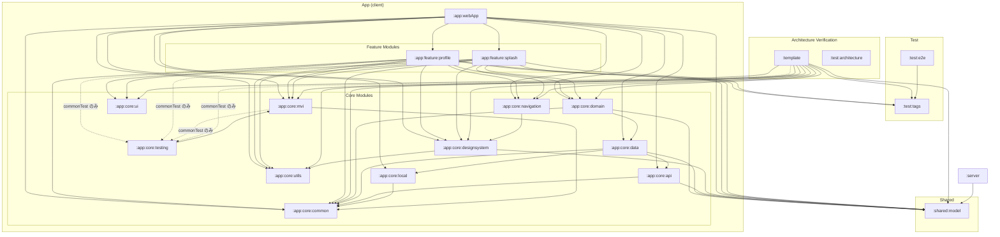

<!-- 編集時は本ファイルと英語版 ModuleOverview.en.md を必ず同期させること。 -->

<a href="ModuleOverview.en.md">🌐 English</a>

## 概要
kei-1111.github.io は、クライアント（`:app`）・サーバー（`:server`）・共有契約（`:shared:model`）・テスト（`:test`）を責務ごとに分けたマルチモジュール構成です。

## モジュール依存関係図

- トップレベルは `:app` / `:server` / `:shared:model` の 3 層。`:shared:model` が葉（無依存）で、`:app` と `:server` は相互依存なし
- 矢印は依存の方向（依存元 → 依存先）
- `:app:feature:*` は `:app:core:data` に依存しない（データアクセスは必ず `:app:core:domain` 経由）
- `:test:tags` は feature の commonMain 依存として本番配布物にも含まれ、`:test:e2e` は本番グラフ外
- `:template` は golden Screen/Dialog destination をコンパイルする非配布モジュールで、`:app:webApp` からは参照されない

```mermaid
flowchart TB
    subgraph "Shared"
        model[":shared:model"]
    end

    subgraph "Test"
        testTags[":test:tags"]
        testE2e[":test:e2e"]
    end

    subgraph "Architecture Verification"
        template[":template"]
        testArchitecture[":test:architecture"]
    end

    server[":server"]

    subgraph "App (client)"
        webApp[":app:webApp"]

        subgraph "Feature Modules"
            profile[":app:feature:profile"]
            splash[":app:feature:splash"]
        end

        subgraph "Core Modules"
            domain[":app:core:domain"]
            data[":app:core:data"]
            api[":app:core:api"]
            local[":app:core:local"]
            designsystem[":app:core:designsystem"]
            mvi[":app:core:mvi"]
            navigation[":app:core:navigation"]
            testing[":app:core:testing"]
            ui[":app:core:ui"]
            common[":app:core:common"]
            utils[":app:core:utils"]
        end
    end

    webApp --> profile & splash
    webApp --> api & common & data & designsystem & domain & local & mvi & navigation & utils & model

    profile & splash --> common & designsystem & domain & mvi & navigation & ui & utils & model & testTags
    template --> common & designsystem & domain & mvi & navigation & ui & utils & model & testTags
    profile & splash & mvi & template -. commonTest のみ .-> testing

    domain --> common & data & model
    data --> api & common & local & model
    api --> common & model
    local --> common
    mvi --> common
    testing --> mvi
    navigation --> designsystem
    designsystem --> model & utils

    server --> model

    testE2e --> testTags
```

## Modules

`:app` と `:test` は実モジュールではなくディレクトリグループです。

| モジュール | 役割 | 正本・規約 |
|---|---|---|
| `:shared:model` | クライアントとサーバーが共有する DTO。`@Serializable` 型は両者の JSON 契約 | `.claude/rules/shared-model.md`、通信時の形状はサーバーの契約テスト |
| `:server` | Cloud Run にデプロイする Ktor/JVM バックエンド。GitHub GraphQL API・管理コンソール(kei-1111-admin)が GCS へ公開したコンテンツ・静的フォールバックコンテンツからデータを組み立て、キャッシュ・レート制限・障害時応答を担う | `.claude/rules/server.md`、ルートはソースコード |
| `:template` | create-destination テンプレートのコンパイル正本。golden Screen/Dialog destination から `.template` を生成する。`:app:webApp` からは参照されない | `scripts/generate_destination_templates.sh` |
| `:app:webApp` | エントリーポイント。DI ルート `AppGraph` と `AppNavDisplay`（Navigation 3）を実装。配布ターゲットは wasmJs のみ | ソースコード |
| `:app:core:common` | 結果型・Flow 変換・ディスパッチャなど複数層で共有する非 UI 基盤 | `.claude/rules/error-handling.md` |
| `:app:core:mvi` | ViewModel と State/Intent/Effect 契約を含む MVI 基盤 | `.claude/rules/mvi-architecture.md`、テストは `.claude/rules/mvi-testing.md` |
| `:app:core:navigation` | Navigation 3 の共通シーン戦略・遷移メタデータ・one-shot 結果通知基盤 | `.claude/rules/navigation.md` |
| `:app:core:testing` | クライアントユニットテスト専用の coroutine/ViewModel 支援。配布物に含めない | `.claude/rules/mvi-testing.md` |
| `:app:core:ui` | 見た目を持たない状態付き Compose ヘルパー（視覚要素は `:designsystem` が担う） | ソースコード |
| `:app:core:domain` | ビジネスロジック（UseCase）。Repository を呼ぶ薄いラッパーで `Flow` を返す | `.claude/rules/usecase.md` |
| `:app:core:data` | Repository によるデータアクセス層。リモート・ローカル・静的コンテンツを `Flow` に集約 | `.claude/rules/data-layer.md`、Repository 一覧はソースコード |
| `:app:core:api` | 自作バックエンドとの HTTP 通信層。取得・デシリアライズ・失敗の `null` への畳み込み | `.claude/rules/data-layer.md`、構成はソースコード |
| `:app:core:local` | ローカル永続化層。テーマ / 表示言語を共有する設定 DataStore と最終通知 PR 番号へのアクセス、破損時回復 | `.claude/rules/data-layer.md` |
| `:app:core:designsystem` | Material 非依存のテーマ・色・タイポグラフィ・アイコンなどの視覚基盤と共有 UI コンポーネント | `.claude/rules/ui-implementation.md` |
| `:app:core:utils` | ブラウザと非出荷 Android の差分を吸収する expect/actual ユーティリティ | ソースコード |
| `:app:feature:profile` | Android Studio 風 IDE UI でプロフィール・作品・技術情報・ライセンスを表示する主機能 | `.claude/rules/ui-implementation.md`、UI 挙動はソースコード |
| `:app:feature:splash` | 起動時のビルドログ風 UI とリソース準備、成功後の主画面への遷移 | ソースコード |
| `:test:tags` | Compose と Playwright が共有する `TestTags` 定数 | ビルド設定 |
| `:test:e2e` | 静的配信した wasm クライアントを Playwright/JVM の実ブラウザで検証 | `.claude/rules/ui-testing.md`、CI 条件はワークフロー |
| `:test:architecture` | `app/feature` と `:template` を走査し、文書化された規約と 1:1 に対応する Konsist チェックを実行する規約ゲート | `.claude/rules/mvi-architecture.md`、`.claude/rules/navigation.md`、`.claude/rules/naming-conventions.md` |
